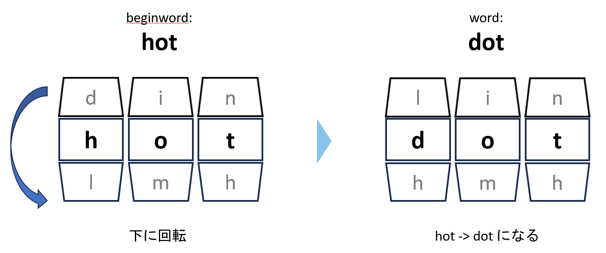

## Step.0
まずは自力で解くことを試みる  
`biginWord`から始めて、一文字違いになるようにリストから取り出していき`endWord`まで変換していくときの、最小回数を求める  
イメージはダイヤル錠を回してリストのある単語を作っていく縛りをつけながらゴールを目指す感じ？  
下に作ったスライドみたいなのを妄想した  
#### problem_image.png


一文字ずつ変えて遷移していくことを考えていくと、  
今見ている単語から一文字変えてリストにある単語に変えられるものをスタックで保持しながら幅優先探索すればよいのか...？  
ただ、到達不可の判定の仕方が分からない  

一文字違いの単語を検出するには？　⇒　一文字ずつ検証して違いが一か所だけある場合と考える他アイデアが出てこなかった  
一文字違いの単語をまとめた辞書`diff_one_letter_dict`を始めに作成する  

次にチェックする単語キュー`queue`を用意して、キュー内にある単語を全て見終えて1ループにする  
`queue`内の単語から辞書を検索して、`endWord`がないなら`queue`に追加していく  
`endWord`が見つかったときに、ループの回数を出力する  

### 書いたコード
```python
class Solution:
    def ladderLength(self, beginWord: str, endWord: str, wordList: List[str]) -> int:
        queue = set()
        sequence_num = 2

        if endWord not in wordList:
            return 0

        for word in wordList:
            diff_count = sum(1 for a, b in zip(beginWord, word) if a != b)
            if diff_count == 1:
                queue.add(word)
        
        if endWord in queue:
            return sequence_num
        
        diff_one_letter_dist = defaultdict(list)
        for target_word in wordList:
            for word in wordList:
                diff_count = sum(1 for a, b in zip(target_word, word) if a != b)
                if diff_count == 1:
                    diff_one_letter_dist[target_word].append(word)

        while True:
            sequence_num += 1
            tmp_queue = set()
            for word in queue:
                if endWord in diff_one_letter_dist[word]:
                    return sequence_num
                tmp_queue.update(diff_one_letter_dist[word])
            queue = tmp_queue
```
`testcase`は大丈夫だったが、`submit`はほぼ通らなかった(3/52)  
到達不可のチェックを最初にしか行っていないのがマズい...  
これ以上自力ではアイデアが思いつかなかったので、他の方々のPRを拝見する  

## Step.1
他の方々のPR・Geminiの出力を拝見し修正を行っていく
Geminiに聞いてみると、次のような導入が考えられると教えてくれた  

「ワイルドカード」の考え方の利用  
　例えば、`hot`という単語に対して、`*ot`, `h*t`, `ho*`という組み合わせを考える  
 　`*`の部分を任意の文字に置き換えられるイメージ
辞書に格納するときに、`*ot`のグループに`dot`,`lot`などをまとめて入れることが出来る  
`pattern`と置いて、作成してみる  

訪問済みリスト`visited`の使用  
最短経路を考えるなら、一度通った単語をもう一度使うことはない(ループ部分は削除可能なため)  
一度使った単語を`visited`に格納しておくことで、`endWord`に到達不可の判定も行える

提言をもとに修正する  

### 書いたコード2

```python
from collections import defaultdict

class Solution:
    def ladderLength(self, beginWord: str, endWord: str, wordList: list[str]) -> int:
        if endWord not in wordList:
            return 0

        diff_one_letter_dist = defaultdict(list)
        word_length = len(beginWord)
        for word in wordList:
            for i in range(word_length):
                pattern = word[:i] + "*" + word[i + 1:]
                diff_one_letter_dist[pattern].append(word)

        queue = {beginWord}      
        visited = {beginWord}    
        sequence_num = 1         

        while queue:
            sequence_num += 1
            tmp_queue = set()
            
            for word in queue:
                # 現在の単語から1文字変えたパターンを探す
                for i in range(word_length):
                    pattern = word[:i] + "*" + word[i + 1:]
                    
                    for next_word in diff_one_letter_dist[pattern]:
                        if next_word == endWord:
                            return sequence_num
                        
                        if next_word not in visited:
                            visited.add(next_word)
                            tmp_queue.add(next_word)
            
            queue = tmp_queue
            if not queue:
                break
        return 0
```

`submit`の方もAC  
自力で書いたコードも考え方は大筋合っていたと思うが、コード2にたどりつくのはなかなか厳しいところだった  

時間計算量：書く単語の長さを`L`とすると、`N`個の単語リストについて`L`個のパターンを作る、  
            各パターン作成のための文字列スライスに`O(L)`かかるので、合計`O(N*L^2)`  
空間計算量：`N`個の単語に対して`L`個のパターンを作成するので、辞書の`Key`, `Value`を合わせて`O(N*L^2)`  

## Step.2
コード2を見ずに3回ミスなく書く
