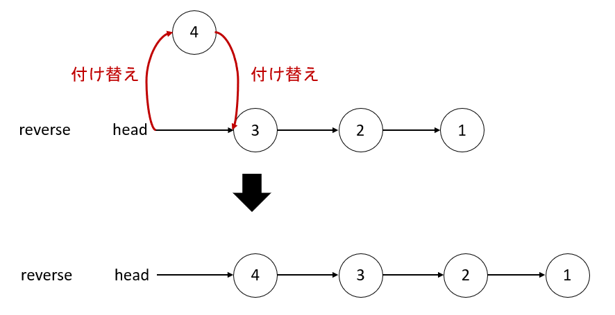

# Step.0　まずは参考文献なしに
linked listを逆順に直したいということで、はじめに思いついたのは、  
もとのリストを`original`、求める逆順リストを`reverse`としたときに、  
while文で`original`前から順にノードを見ていき、その順に`reverse`の先頭につけていくこと 
&nbsp;  
下のようなイメージ  


このアイデアのもとコードを書いてみる
`original`からノードを取り出したときに、新たに付けるノードとして`new_node`と命名  
`new_node`に今まで処理した`reverse`をつなげたものを新たな`reverse`とする  
実際に書いたのが次のコード  

```python
# Definition for singly-linked list.
# class ListNode:
#     def __init__(self, val=0, next=None):
#         self.val = val
#         self.next = next
class Solution:
    def reverseList(self, head: Optional[ListNode]) -> Optional[ListNode]:
        stack = []
        original = head
        reverse = None

        while original:
            new_node = ListNode(original.val)  # ノードを一つ取り出す
            new_node.next = reverse            # 今まで処理したreverseをつなげる
            reverse = new_node
            original = original.next
        
        return reverse
```
無事Accept!
&nbsp;  
時間計算量:O(N)　全てのリスト要素を見る必要があるため、リストの長さに比例  
空間計算量:O(N)　新たにノードを作成しているので、リストの長さに比例

# Step.1 参考文献ありでコード洗練
Step.0では`reverse`に追加していくノードを毎回作っていたため、空間計算量がO(N)になっていた  
この部分を、新たにノード生成せずに変数のみで完結できれば、O(1)にできそう  
&nbsp;
5分ほど考えたが、自力では思いつかなかったのでgeminiにヒントをもらいつつコードを書く  
アイデアとしては、まずwhile文でもとのリストを前から順にみていく  
見ているノードの次以降の部分を一時変数`tmp_nodes`で保持しておく  
`tmp_nodes`以前の部分のノードの向きを入れ替える 
という感じ  
&nbsp;
実際に書いたのが次のコード  
```python
# Definition for singly-linked list.
# class ListNode:
#     def __init__(self, val=0, next=None):
#         self.val = val
#         self.next = next
class Solution:
    def reverseList(self, head: Optional[ListNode]) -> Optional[ListNode]:
        stack = []
        original = head
        reverse = None

        while original:
            tmp_nodes = original.next  # 次以降のノード達を保持
            original.next = reverse    # ノードの向きを逆に付け替える
            reverse = original         # 付け替えたものが新たなreverseとなる
            original = tmp_nodes       # 保持した次以降のノードを戻す
        
        return reverse
```
これで時間計算量がO(1)となる

# Step.2 follow up
follow upにて、whileによる反復のほか再帰でも実装できるとあったので、再帰の場合にトライ  
アイデアとしては、再帰で一番最後のノードまで到達した後、  
今見ているノード`head`とその次のノード`head.next`について、  
次のノードの次に指すノードを今見ているノードにする`head.next.next = head`  
これによって、ノードの指す向きを逆にできる
ホントは`head`のまま扱いたくはないが、再帰呼び出しの都合上`head`のままで
```python
# Definition for singly-linked list.
# class ListNode:
#     def __init__(self, val=0, next=None):
#         self.val = val
#         self.next = next
class Solution:
    def reverseList(self, head: Optional[ListNode]) -> Optional[ListNode]:
        if not head or not head.next:
            return head

        reverse = self.reverseList(head.next) 
        head.next.next = head                  # ノードの向きを逆向きにする
        head.next = None

        return reverse
```
&nbsp;  
時間計算量:O(N)　全てのリスト要素を見る必要があるため、リストの長さに比例  
空間計算量:O(N)　リストの要素分だけ関数を再帰呼び出しするため、リストの長さに比例
